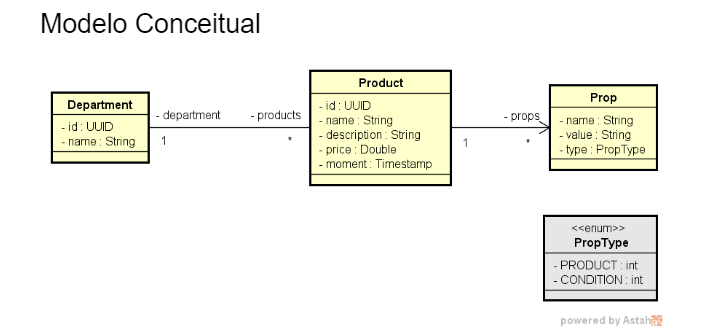
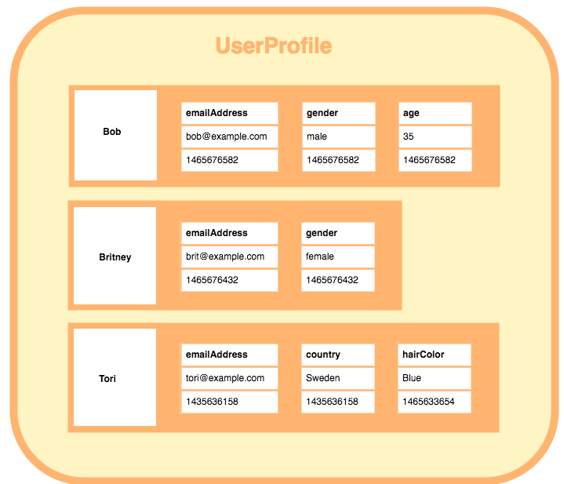

  

# Objetivo

Workshop NOsql com Cassandra.

Aprenderemos fundamentos e configuração do banco de dados Cassandra.

[Github](https://github.com/devsuperior/nosql/tree/main/workshop-springboot3-cassandra3)

# Sobre o Sistema

Será o DSProducts

## UML

Cada departamento terá vários produtos. E os produtos estão por sua vez, agregados ao Departamento.

Um produto terá várias propriedades (props).

O moment dessa vez, será TimeStamp, não Instant.

## Coleção Postman

[Github](https://github.com/devsuperior/nosql/blob/main/workshop-springboot3-cassandra3/DSProducts.postman_collection.json)

## Tipo de banco noSQL (Cassandra)

Ele é um banco de dados Column Store!

O que é um banco column store? [Veja aqui](https://database.guide/what-is-a-column-store-database/)

Bom, ele tem o Keyscape, seria as "schemas" do banco relacional.

Um keyscape é composto por column families (a tabela) do banco relacional.

Se chama column family porque não necessariamente todo registro dessa família de colunas (linhas) terão as mesmas colunas.

Veja o UserProfile.

O bob tem email, gênero e idade. Já a Brittney possui somente email e gênero! Já o Tori tem email, country e cor de cabelo.

# Query-driven modeling

Vamos falar sobre a documentação do Cassandra.

[Doc cassandra](https://cassandra.apache.org/doc/latest)

## Data Modeling.

O cassandra preconiza (nos orienta) que precisamos moldar os dados orientado para as consultas que vamos precisar (query-driven modelling). https://cassandra.apache.org/doc/4.1/cassandra/data_modeling/intro.html#query-driven-modeling

Para batermos o martelo e decidir como vamos distribuir nossa UML em tabelas, temos que nos perguntar: Quais as consultas mais frequentes/importantes que faremos?

Além disso, na hora de modelar os dados não temos conceitos de relacionamentos, transações, junções (join).

Então se criamos no Cassandra uma Column Family, ela será indepdente dos outros. Podemos salvar e deletar alguem, sem que o banco de dados nos alerta que estamos violando uma integridade referencial.

### Qual o custo disso?

Teremos um trabalho adicional em nivel de aplicação (logica para ver se está tudo ok) para controlarmos.

### Decidindo armazenamento de dados - Cassandra

Analisaremos o escopo que queremos, as consultas que iremos precisar pra depois fazermos as agregações.

## Escopo de projeto

-CRUD completo de Departamentos (incluindo listagem de departamentos para que o -usuário selecione um departamento)

Se quisermos cadastrar no futuro, uma tela de cadastro de Produto. Quando formos cadastrar ele, precisar falar seu departamento (mostrando ao usuário uma lista de departamento para ele escolher).

Ou seja, a entidade Department será armazaneda em uma tabela só para ela.

-Busca de produtos por nome do departamento

Ou seja, o Produto será agregado com o nome do departamento. (Agregação)

-Busca de produtos por texto na descrição

A description já está na entidade Product. Mas criaremos depois um índice para fazer essa busca por texto.

-Buscar todos detalhes de um produto inclusive suas propriedades

Em noSQL estaremos sendo prezando pela rapidez e boa funcionalidade. Então a ideia é, pesquisou produto? Que venha as props (propriedades) junto.

## Cassanda no Docker

Instalaremos o servidor Cassandra via container docker, instanciando um container pegando imagem do Cassandra oficial no dockerhub.

## Instalar Docker

Se não tem wsl, vá no prompt/powershell e digite wsl --install. Depois instale o docker.

## Voltando para Docker + MongoDB

Tags Cassandra selecionar latest (windows). - https://hub.docker.com/_/cassandra

1. Abra o docker e logue.
2. Abrir powershell como admin ou usar terminal docker.
3. Comando: docker run -d -p 9042:9042 --name cassandra1 cassandra:3.11.10
   :versaoaqui

docker exec -it cassandra1 bash

Para verificar localização de data volumes

https://stackoverflow.com/questions/43181654/locating-data-volumes-in-docker-desktop-windows

\\wsl.localhost\docker-desktop

## Acessando o Cassandra via terminal cqlsh

Para docker: docker stop af7 (inicio do nome do container)

Start: docker start af7

docker exec -it cassandra1 bash

cqlsh (rodar o prompt do cassandra)

E agora usaremos uns comando do CQL:  https://github.com/devsuperior/nosql/tree/main/workshop-springboot3-cassandra3#cqlsh

Quando você cria um Keyspace no cassandra, você precisa dar ao menos algumas configurações, como simplestrategy, replication_factor (não ira replicar dados).

use testdb = acessa a keyspace criada

agora podemos criar as tabelas (create table), passamos o nome+tipo do atributo.

depois inserts

Se formos fazer uma consulta sql normal filtrando, dá um erro de servidor. Precisamos colocar o ALLOW FILTERING.

Consultas mais coplexas como Like não são muito amigáveis. Like por exemplo é so para campos indexados. Como adicionar o indice para usar o Like?

Usa o Create custom index e depois podemos usar o like

### collection postman

https://github.com/devsuperior/nosql/blob/main/workshop-springboot3-cassandra3/DSProducts.postman_collection.json

