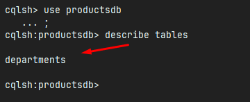

<p align="center">
  
</p>

# Objetivo

Workshop NOsql com Cassandra.

Aprenderemos fundamentos e configuração do banco de dados Cassandra.

[Github](https://github.com/devsuperior/nosql/tree/main/workshop-springboot3-cassandra3)

# Sobre o Sistema

Será o DSProducts

# UML


Cada departamento terá vários produtos. E os produtos estão por sua vez, agregados ao Departamento.

Um produto terá várias propriedades (props).

O moment dessa vez, será TimeStamp, não Instant.

# Coleção Postman

[Github](https://github.com/devsuperior/nosql/blob/main/workshop-springboot3-cassandra3/DSProducts.postman_collection.json)

# Tipo de banco noSQL (Cassandra)

Ele é um banco de dados Column Store!

O que é um banco column store? [Veja aqui](https://database.guide/what-is-a-column-store-database/)

Bom, ele tem o Keyscape, seria as "schemas" do banco relacional.

Um keyscape é composto por column families (a tabela) do banco relacional.

Se chama column family porque não necessariamente todo registro dessa família de colunas (linhas) terão as mesmas colunas.

Veja o UserProfile.


O bob tem email, gênero e idade. Já a Brittney possui somente email e gênero! Já o Tori tem email, country e cor de cabelo.

# Query-driven modeling

Vamos falar sobre a documentação do Cassandra.

[Doc cassandra](https://cassandra.apache.org/doc/latest)

# Data Modeling.

O cassandra preconiza (nos orienta) que precisamos moldar os dados orientado para as consultas que vamos precisar (query-driven modelling). 
[Veja aqui](https://cassandra.apache.org/doc/4.1/cassandra/data_modeling/intro.html#query-driven-modeling)

Para batermos o martelo e decidir como vamos a nossa UML em tabelas, temos que nos perguntar: quais as consultas mais frequentes/importantes que faremos?

Além disso, na hora de modelar os dados não temos conceitos de relacionamentos, transações, junções (join).

Então se criamos no Cassandra uma Column Family, ela será independente dos outros. Podemos salvar e deletar alguém, 
sem que o banco de dados nos alerta que estamos violando uma integridade referencial.

## Qual o custo disso?

Teremos um trabalho adicional em nível de aplicação (lógica para ver se está tudo ok) para controlarmos.

# Decidindo armazenamento de dados - Cassandra

Analisaremos o escopo que queremos, as consultas que iremos precisar para depois fazermos as agregações.

# Escopo de projeto

- CRUD completo de Departamentos (incluindo listagem de departamentos para que o -usuário selecione um departamento)

Imagine se quisermos cadastrar no futuro uma tela de cadastro de Produto. Quando formos cadastrar ele, precisar falar 
seu departamento (mostrando ao usuário uma lista de departamento para ele escolher).

Ou seja, a entidade Department será armazenada em uma tabela só para ela.

- Busca de produtos por nome do departamento

Ou seja, o Produto será agregado com o nome do departamento. (Agregação)

- Busca de produtos por texto na descrição

A description já está na entidade Product. Mas criaremos depois um índice para fazer essa busca por texto.

- Buscar todos detalhes de um produto inclusive suas propriedades

Em noSQL estaremos sempre prezando pela rapidez e boa funcionalidade. Então a ideia é, pesquisou produto? 
Que venha as props (propriedades) junto.

# Cassanda no Docker

Instalaremos o servidor Cassandra via container docker, instanciando um container pegando imagem do Cassandra oficial no dockerhub.

## Instalar Docker

Se não tem wsl, vá no prompt/powershell e digite wsl --install. Depois instale o docker.

## Voltando para Docker + Cassandra

Tags Cassandra selecionar latest (windows). - https://hub.docker.com/_/cassandra

1. Abra o docker e logue.
2. Abrir powershell como admin ou usar terminal docker.
3. Comando: docker run -d -p 9042:9042 --name cassandra1 cassandra:3.11.10
   :versaoaqui

docker exec -it cassandra1 bash

Para verificar localização de data volumes

https://stackoverflow.com/questions/43181654/locating-data-volumes-in-docker-desktop-windows

\\wsl.localhost\docker-desktop

## Acessando o Cassandra via terminal cqlsh

Para docker: docker stop af7 (inicio do nome do container)

Start: docker start af7

docker exec -it cassandra1 bash

cqlsh (rodar o prompt do cassandra)

E agora usaremos uns comando do CQL: [Veja](https://github.com/devsuperior/nosql/tree/main/workshop-springboot3-cassandra3#cqlsh)

```sql
CREATE KEYSPACE testdb WITH replication = {'class': 'SimpleStrategy', 'replication_factor' : 1};
```

Quando você cria um Keyspace no Cassandra, você precisa dar ao menos algumas configurações, como simplestrategy, 
replication_factor (não ira replicar dados).

use testdb = acessa a keyspace criada

```sql
CREATE TABLE post(id uuid, moment timestamp, body text, author varchar, PRIMARY KEY (id));
````

Agora podemos criar as tabelas (create table), passamos o nome+tipo do atributo.

```sql
INSERT INTO post (id, moment, body, author) VALUES (uuid(), '2021-02-26T10:00:00Z', 'Bom dia!', 'Bob');
INSERT INTO post (id, moment, body, author) VALUES (uuid(), '2021-02-27T10:00:00Z', 'Partiu viagem', 'Maria');
INSERT INTO post (id, moment, body, author) VALUES (uuid(), '2021-02-27T10:00:00Z', 'Que dia bonito!', 'Maria');
```

Depois inserts.

```sql
SELECT * FROM post;

SELECT * FROM post WHERE author = 'Maria' ALLOW FILTERING;
```

Se formos fazer uma consulta sql normal filtrando, dá um erro de servidor. Precisamos colocar o ALLOW FILTERING.

Consultas mais complexas como "Like" não são muito amigáveis. "Like", por exemplo, é so para campos indexados. Como adicionar o 
índice para usar o "Like"?

```sql
CREATE CUSTOM INDEX body_idx ON post (body) USING 'org.apache.cassandra.index.sasi.SASIIndex' WITH OPTIONS = {'mode': 'CONTAINS', 'analyzer_class': 'org.apache.cassandra.index.sasi.analyzer.NonTokenizingAnalyzer','case_sensitive': 'false'};
```

Usa o Create custom index.

```sql
SELECT * FROM post WHERE body LIKE '%MORNING%';
```

# Códigos (properties, CassandraConfig, SeedConfig)

Repare que no CassandraConfig, temos um método chamado ``getEntityBasePackages``. Precisamos colocar o path onde as 
entities ficarão.

## properties

```properties
spring.data.cassandra.contact-points=localhost
spring.data.cassandra.keyspace-name=productsdb
spring.data.cassandra.port=9042

spring.data.cassandra.local-datacenter=datacenter1
```

```java
@Configuration
public class CassandraConfig extends AbstractCassandraConfiguration {

	@Value("${spring.data.cassandra.keyspace-name}")
	private String keyspace;

	@Value("${spring.data.cassandra.contact-points}")
	private String contactPoint;

	@Value("${spring.data.cassandra.port}")
	private int port;
	
	@Value("${spring.data.cassandra.local-datacenter}")
	private String localDatacenter;

	@Override
	public String getContactPoints() {
		return contactPoint;
	}

	@Override
	protected int getPort() {
		return port;
	}

	@Override
	public SchemaAction getSchemaAction() {
		return SchemaAction.CREATE_IF_NOT_EXISTS;
	}

	@Override
	protected List<CreateKeyspaceSpecification> getKeyspaceCreations() {
		return Collections.singletonList(CreateKeyspaceSpecification.createKeyspace(keyspace).ifNotExists()
				.with(KeyspaceOption.DURABLE_WRITES, true).withSimpleReplication(1L));
	}

	@Override
	protected String getLocalDataCenter() {
		return localDatacenter;
	}

	@Override
	protected String getKeyspaceName() {
		return keyspace;
	}

	@Override
	public String[] getEntityBasePackages() {
		return new String[] { "com.devsuperior.meuprojeto.model.entities" };
	}
}
```

## StandartError e ControllerHandler

```java
public class StandardError implements Serializable {
	private static final long serialVersionUID = 1L;

	private Long timestamp;
	private Integer status;
	private String error;
	private String message;
	private String path;
}
```

```java
@ControllerAdvice
public class ResourceExceptionHandler {

	@ExceptionHandler(ResourceNotFoundException.class)
	public ResponseEntity<StandardError> resourceNotFound(ResourceNotFoundException e, HttpServletRequest request) {
		
		HttpStatus status = HttpStatus.NOT_FOUND;
		
		StandardError error = new StandardError();
		error.setError("Not found");
		error.setMessage(e.getMessage());
		error.setPath(request.getRequestURI());
		error.setStatus(status.value());
		error.setTimestamp(Instant.now());
	
		return ResponseEntity.status(status).body(error);
	}
}
```

## Seed

```java
@Configuration
@Profile("test")
public class TestConfig {

	@Autowired
	private DepartmentRepository departmentRepository;
	
	@Autowired
	private ProductRepository productRepository;
	
	@PostConstruct
	public void init() {
		
		departmentRepository.deleteAll();
		productRepository.deleteAll();

		Department d1 = new Department(UUID.randomUUID(), "Livros");
		Department d2 = new Department(UUID.randomUUID(), "Computadores");
		Department d3 = new Department(UUID.randomUUID(), "Jogos");

		departmentRepository.saveAll(Arrays.asList(d1, d2, d3));

		Product p1 = new Product(UUID.randomUUID(), d1.getName(), 180.90, Instant.parse("2021-02-25T10:00:00Z"), "O Senhor dos anéis", "Um conjunto de amigos se unem para combater uma grande ameaça na Terra Média");
		p1.getProps().add(new Prop("Páginas", "1055", PropType.PRODUCT));
		p1.getProps().add(new Prop("Edição", "5", PropType.PRODUCT));

		Product p2 = new Product(UUID.randomUUID(), d1.getName(), 78.00, Instant.parse("2021-02-26T11:00:00Z"), "O Código da Vinci", "Um grande mistério se desenrola em Paris sobre a busca do Santro Graal");
		p2.getProps().add(new Prop("Páginas", "325", PropType.PRODUCT));
		p2.getProps().add(new Prop("Edição", "3", PropType.PRODUCT));	

		Product p3 = new Product(UUID.randomUUID(), d2.getName(), 3490.00, Instant.parse("2021-02-26T12:00:00Z"), "PC Gamer", "Computador especial para quem deseja performance nos seus games");
		p3.getProps().add(new Prop("Memória", "16GB", PropType.PRODUCT));
		p3.getProps().add(new Prop("CPU", "Core i9", PropType.PRODUCT));
		p3.getProps().add(new Prop("Garantia", "1 ano", PropType.CONDITION));

		Product p4 = new Product(UUID.randomUUID(), d2.getName(), 2497.90, Instant.parse("2021-02-26T13:00:00Z"), "Desktop PC", "O equilíbro entre curso e performance para sua comodidade");
		p4.getProps().add(new Prop("Memória", "8GB", PropType.PRODUCT));
		p4.getProps().add(new Prop("CPU", "Core i5", PropType.PRODUCT));
		p4.getProps().add(new Prop("Garantia", "1 ano", PropType.CONDITION));

		Product p5 = new Product(UUID.randomUUID(), d3.getName(), 239.00, Instant.parse("2021-02-27T14:00:00Z"), "The Last of Us 2", "Um mundo pós-apocalíptico enfrente uma grande ameaça novamente");
		p5.getProps().add(new Prop("Ano", "2021", PropType.PRODUCT));

		productRepository.saveAll(Arrays.asList(p1, p2, p3, p4, p5));
	}
}
```

# Mapeamento de Classes

Reveja o [UML](#uml)

## Department

```java
@NoArgsConstructor
@AllArgsConstructor
@Getter
@Setter
@Table(value = "departments")
public class Department {

    private UUID id;
    private String name;

}
```

Para ver a tabela criada, vá no terminal powershell:

> docker ps
> docker exec -it cassandra-1 bash
> cqlsh
> describe keyspaces
> use productsdb;
> describe tables



## Product

## Prop

A anotação UserDefinedType, especificando que essa classe é um tipo definido pelo usuário. Dentro dela, passamos o tipo
que está registrado no banco do Cassandra, "prop".

```java
@NoArgsConstructor
@AllArgsConstructor
@Getter
@Setter
@UserDefinedType("prop")
public class Prop {

    private String name;
    private String value;
    private PropType type;
}
```